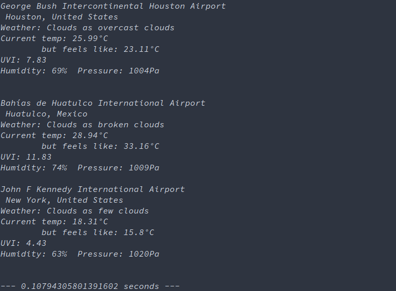

# Weather Forecast App
[](https://shields.io/)
[](https://github.com/ellerbrock/open-source-badges/)
[](https://shields.io/)  
[](https://www.python.org/)  


## Table of contents
* [About the Project](#about-the-project)
* [Getting Started](#getting-started)
  * [Prerequisites](#prerequisites)
  * [Installation](#installation)
* [Usage](#usage)
  * [Tests](#tests)
* [Contributing](#contributing)
* [Contact](#contact)
* [Acknowledgements](#Acknowledgements)


# About the Project
Basically this project retrieves weather forecast data from an [OpenWeather](https://openweathermap.org/) API request. For now it only reads data from `.csv` files containing IATA codes or cities and display their weather forecast information on a simple-human-comprehensible terminal app  
Currently working on an GUI so you can search places and, overall, have a prettier data visualization.

# Getting Started
Since this app is all made with `Python` you're going to need some python-libraries and utilities listed below.


## Prerequisites
* First check that your current `Python` version is `Python 3.6` or above, by running the following command on your terminal:
```shell
python --version
```
> `Python 3.8+` is recommended 

  Note that in some linux distros you'll need to run it as:  
  ```shell
  python3 --version
  ```


* You migth as well check if you have PyPI as your Python package installer:  
  Since this process vary for every Linux distro, I'll link you to an article explanning how to set
  [PyPI](https://www.tecmint.com/install-pip-in-linux/) up.  

## Installation
1. Get a free `OpenWeather` API Key at https://openweathermap.org/appid
2. Clone the repo
```shell
git clone https://github.com/DiXap/WeatherForecastApp.git
```
3. Verify or install Python packages
  For all the packages listed bwlow, run the following command where `<pkg>` is the name of the package.
  ```shell
  pip install <pkg>
  ```
  * `requests`
  * `unidecode`
  * `pandas`

4. Enter your API Key in `main.py`
```python
API = 'ENTER_YOUR_API_KEY'
```

# Usage
As mentioned before, the app only reads csv files, although you can modify the functions in `main.py` in order to request for a specific location forecast.  
Don't delete `Data`/ `resources` directories or its child directories for they're used in the main excecution of the app.
Once you're ready, whether you modify something or not, go to your terminal and in the main directory of the project run the following:
```shell
python main.py
```
> `python3` in some distros

It should output something like:  
  
> If you searched for a place  

  
> If you searched an IATA code

Since `OpeWeather` only admits limitted API calls per minute, the main program is set to make under 60 requests so it doesn't get yourself in trouble.  
If you want to remove this limit go to `main.py` and change the following:
```python
  future = asyncio.ensure_future(get_data_iata(d1_list, states))

  future = asyncio.ensure_future(get_data_place(d2_list, states))
```
By doing this the program will fetch data for all the places contained in the `.csv` files.  
Alternatively, you can fiddle around with the list slices:
```python
  d1_coords = d1_list[:20:-1]

  call = d2_list[200:210]
```

## Tests
In order to get the tests running you'll need to enter your API Key in `tests.py`:
```python
API = 'ENTER_YOUR_API_KEY'
```
These test cases were coded to demostrate functions' error handling.
Feel free to play around with them.

# Contributing
If you want to contribute to this project please read the following steps. Any feedback or contributions are greatly appreciated.
  1. Fork the project
  2. Create your branch  
    ```git checkout -b ideas/MyFeature```  

  3. Commint the changes  
    ```git commit -m "Some awesome ideas" ```  
  4. Push  
    ``` git push origin ideas/MyFeature```  
  5. Open a pull request   

## Open issues
You can open an issue anytime you want.  
Refer to the section [open issues](https://github.com/DiXap/WeatherForecastApp/issues) for a list of known ones.

# Contact
Diego J. Padilla  
[](https://github.com/DiXap)
[](https://mail.google.com/mail/?view=cm&source=mailto&to=dpadlara@gmail.com)<!--- --> 

Alejandro Maldonado  
[](https://github.com/RealMaldov)
[](https://mail.google.com/mail/?view=cm&source=mailto&to=amaldov@ciencias.unam.mx)


# Acknowledgements
* [airport-codes](https://github.com/ram-nadella/airport-codes)
* [Best-README-Template](https://github.com/othneildrew/Best-README-Template)
* [Some cool badges for your README](https://github.com/Naereen/badges)
* [ForTheBadge](http://ForTheBadge.com) 
* [Badges 4 README.md Profile](https://github.com/alexandresanlim/Badges4-README.md-Profile)


---
 
[](http://ForTheBadge.com)  

---
[Go up](#weather-forecast-app)
